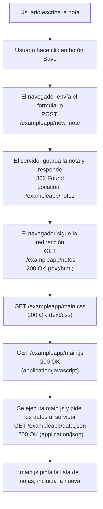

```mermaid
flowchart TD
    A["Usuario escribe la nota"] --> B["Usuario hace clic en botón Save"]
    B --> C["El navegador envía el formulario<br/>POST /exampleapp/new_note"]
    C --> D["El servidor guarda la nota y responde<br/>302 Found<br/>Location: /exampleapp/notes"]
    D --> E["El navegador sigue la redirección<br/>GET<br/> /exampleapp/notes<br/>200 OK (text/html)"]
    E --> F["GET /exampleapp/main.css<br/> 200 OK (text/css)"]
    F --> G["GET /exampleapp/main.js<br/> 200 OK (application/javascript)"]
    G --> H["Se ejecuta main.js y pide los datos al servidor<br/>GET /exampleapp/data.json<br/> 200 OK (application/json)"]
    H --> I["main.js pinta la lista de notas, incluida la nueva"]
```
