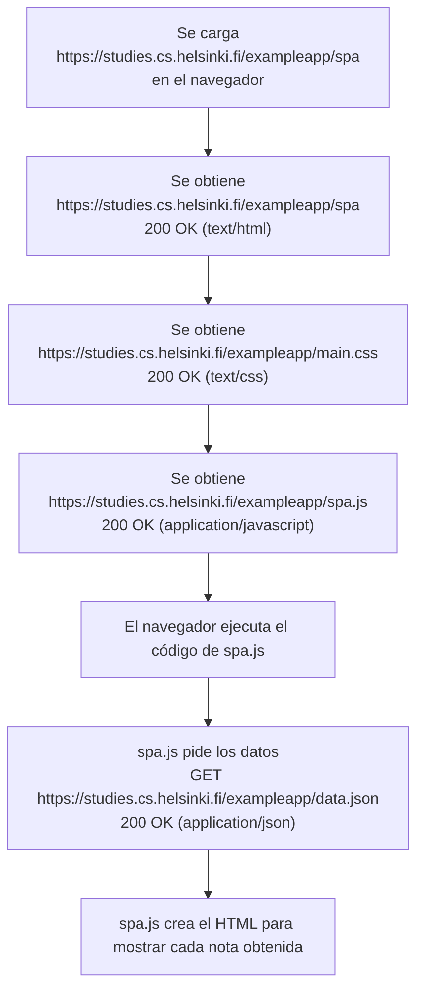

```mermaid
flowchart TD
    A["Se carga<br/>https://studies.cs.helsinki.fi/exampleapp/spa<br/>en el navegador"] --> B["Se obtiene<br/>https://studies.cs.helsinki.fi/exampleapp/spa<br/>200 OK (text/html)"]
    B --> C["Se obtiene<br/>https://studies.cs.helsinki.fi/exampleapp/main.css<br/>200 OK (text/css)"]
    C --> D["Se obtiene<br/>https://studies.cs.helsinki.fi/exampleapp/spa.js<br/>200 OK (application/javascript)"]
    D --> E["El navegador ejecuta el código de spa.js"]
    E --> F["spa.js pide los datos<br/>GET https://studies.cs.helsinki.fi/exampleapp/data.json<br/>200 OK (application/json)"]
    F --> G["spa.js crea el HTML para mostrar cada nota obtenida"]
```
