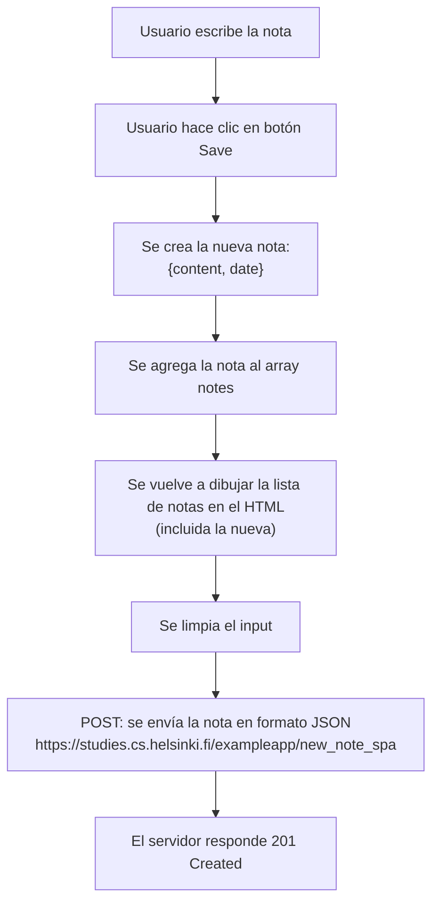

```mermaid
flowchart TD
    A["Usuario escribe la nota"] --> B["Usuario hace clic en botón Save"]
    B --> C["Se crea la nueva nota:<br/>{content, date}"]
    C --> D["Se agrega la nota al array notes"]
    D --> E["Se vuelve a dibujar la lista de notas en el HTML<br/>(incluida la nueva)"]
    E --> F["Se limpia el input"]
    F --> G["POST: se envía la nota en formato JSON<br/>https://studies.cs.helsinki.fi/exampleapp/new_note_spa"]
    G --> H["El servidor responde 201 Created"]
```
